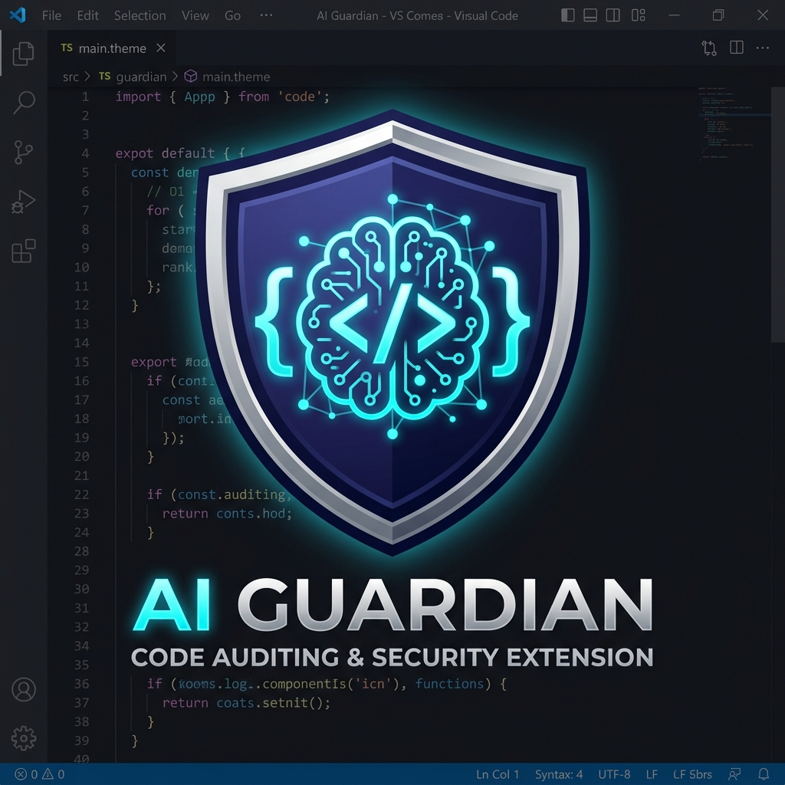

# 🛡️ AI Guardian

*[Leer en Español](README.md)*

<p align="center">
  
</p>

<p align="center">
  <strong>The AI-powered security guardian for your code.</strong><br>
  <em>Intelligent and preventive security auditing for the modern workflow.</em>
</p>

<p align="center">
  
  
  
  
</p>

## What is AI Guardian?

**AI Guardian** is a VS Code extension designed to audit the security of your code, especially when it's generated or assisted by Artificial Intelligence. It combines lightning-fast local static analysis with the semantic power of advanced LLM models under a **BYOK (Bring Your Own Key)** model.

## Key Features

- **Hybrid Auditing**: Combines local pattern-based rules with semantic analysis via LLM.
- **Multi-Provider BYOK**: Native support for **Gemini, OpenAI, and Claude**.
- **Insertion Detection**: Advanced heuristics to detect large blocks of code pasted from AIs.
- **Operational Guardrails**: Strict quota and cost control to protect your budget.
- **Shadow Mode**: Intelligent notifications that only interrupt you for critical risks.
- **Usage Metrics**: Visual real-time dashboard for consumption and quota status.
- **JaCoCo Integration**: Coverage gap detection for Java projects.

## Quick Start

### 1. Installation
Search for "AI Guardian" in the VS Code Marketplace or install dependencies locally for development:
```bash
npm install
npm run compile
```

### 2. BYOK Setup
1. Open the Command Palette (`Ctrl+Shift+P`).
2. Run: `AI Guardian: Setup BYOK (Provider/API Key)`.
3. Select your provider (Gemini, OpenAI, or Claude).
4. Choose a profile (**free, balanced, or deep**).
5. Enter your API Key (safely stored in `SecretStorage`).

## Configuration

You can customize AI Guardian's behavior in the Settings section:

| Setting | Description | Default |
| :--- | :--- | :--- |
| `ai-guardian.llm.provider` | Chosen LLM provider. | `gemini` |
| `ai-guardian.llm.profile` | Depth profile (free, balanced, deep). | `free` |
| `ai-guardian.llm.maxCallsPerHour` | Call limit to protect costs. | `30` |
| `ai-guardian.notifications.shadowMode` | Only interrupt on high risks. | `true` |

## Local Rules

AI Guardian uses a `rules.json` file at your project root for instant, cost-free audits:

```json
[
  {
    "id": "raw-sql-check",
    "language": "java",
    "pattern": "\\.execute(?:Update|Query)?\\s*\\(",
    "message": "Possible SQL Injection detected.",
    "severity": "HIGH"
  }
]
```


## Contributing

Looking to improve AI Guardian? You're welcome! Please check our [CONTRIBUTING.en.md](CONTRIBUTING.en.md) guide.

## Security

Security is my priority. If you find a vulnerability, please refer to our [SECURITY.en.md](SECURITY.en.md) policy.

## Credits and License

Created and maintained by **[Mateo Valencia Ardila](https://github.com/fttmatteo)**.

This software operates under the **MIT License**. You are free to distribute, edit, or use this architectural base even for commercial development under the main mandatory condition of explicitly preserving the copyright and attribution paragraphs to Mateo Valencia as the original creator. (Read the `LICENSE` document for more legal instructions).
